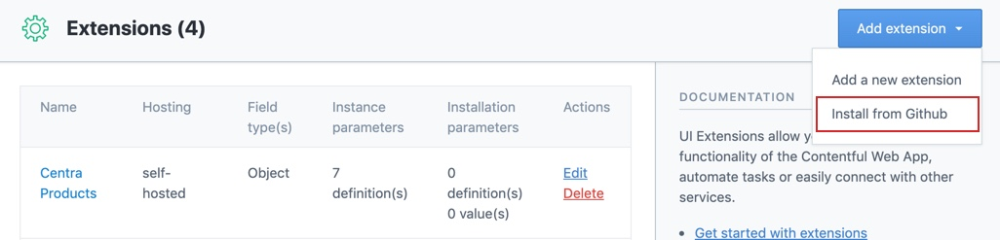
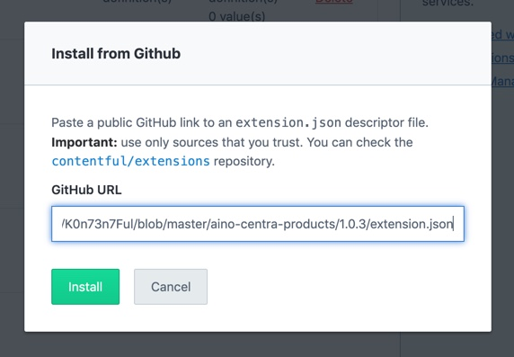

# K0n73n7Ful

## Installation

Follow these steps to install an aino extension.

### Step 1

Go to Settings -> Extensions in Contentful. Click Add Extension -> Install from Github



### Step 2

Fill the extension.json for the extension you want to install.



### Step 3

Choose to use self-hosted hosting. Fill the url to the build folder of the choosen extension. Use the github-pages url here. (Starts with https://aino.github.io/K0n73n7Ful/...)


## Update existing extension

To update an existing extension, use the Contentful CLI from the extensions project folder.

If your extension relies on installation variables, supply them from the command line. If not, they will be cleared on updates.

Example:

```bash
yarn contentful extension update \
  --space-id cu570m3r-sp4c3 \
  --environment-id main \
  --src https://aino.github.io/K0n73n7Ful/aino-centra-products/3.0.1/build/ \
  --installation-parameters '{"parameter1": "Hey!", "parameter2": true}' \
  --force
```
